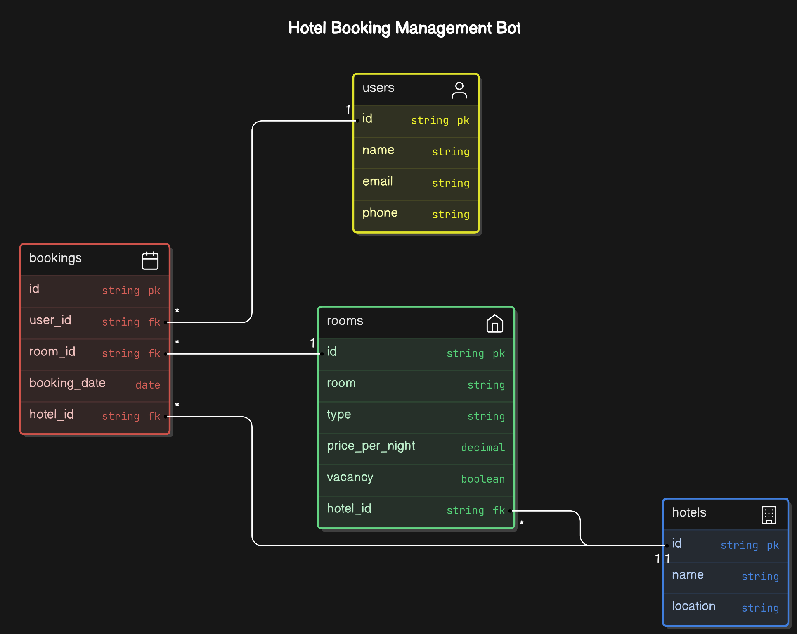

# HotelBot

# Getting Started

__Follow this to get started__ **[Getting Started With Backend](./Getting_Started_Backend.md)**

# Technical Requirement Document

## Project Overview

The project involves creating a chatbot for hotel booking management. The bot will handle user interactions for booking rooms, provide current booking information, and ensure data segregation between different hotels.

## Functional Requirements

### Primary Functionalities

- Respond to users with current booking information.
- Create bookings after taking details from users.
- Store user details and room booking information.
- Uses conversation history as a context throughout the conversation.

### Chatbot Flow

1. User initiates a conversation about booking a resort room.
2. Bot fetches room options from an API and responds with a list of room options.
3. User selects a room.
4. Bot provides pricing information.
5. User confirms they want to proceed with booking.
6. Bot makes a simulated API call to book the room and returns a booking confirmation with a booking ID.

## API Requirements

### Main Endpoint

**POST /chat**: Handle user messages and return chatbot responses.

- **POST /chat** : Room Enquiry when there are available rooms.

	## Request Payload
	```json
		{
			"user_id": 123,
			"message": "I want to book a room./ I want to book rooms.",
			"hotel_id": 456
		}
	```

	## Response

	```json
		{
			"hotel_id": 456,
			"message": "Hello, Welcome to HotelBot, These are the available rooms and their prices: 1. Room 1: $100. 2. Room 2: $200. 3. Room 3: $300.",
			"context": {
				{
					"hotel_id": 456,
					"room_id": 1,
					"room_number":"Room 1",
					"type": "single",
					"vacancy_status": "available",
					"next_available" : "",
					"price_per_night": 100
				},
				{
					"hotel_id": 456,
					"room_id": 2,
					"room_number":"Room 2",
					"type": "double",
					"vacancy_status": "available",
					"next_available" : "",
					"price_per_night": 200
				}
			}
		}
	```

- **POST /chat** : Room Enquiry when there are no available rooms.

	## Request Payload
	```json
		{
			"user_id": 123,
			"message": "I want to book a room./ I want to book rooms.",
			"hotel_id": 456
		}
	```

	## Response

	```json
		{
			"hotel_id": 456,
			"message": "Hello, Welcome to HotelBot, We are sorry, there are no available rooms at the moment. Please try booking with us again later.",
			"context": {
				
			}
		}
	```

- **POST /chat** : Booking a room/rooms for some days.

	## Request Payload
	```json
		{
			"user_id": 123,
			"message": "I will book Room 1/Room2/Room3.",
			"hotel_id": 456
		}
	```

	## Response

	```json
		{
			"hotel_id": 456,
			"message": "Thanks for booking with us. Your booking ids are 123,124,125 and you are booking room 1,room2,room3.",
			"total_price": 200,
			"context": {
				{
					"booking_id": 123,
					"hotel_id": 456,
					"room_id": 1,
					"user_id" : 123,
					"booking_date" : "2022-01-01",
				},
				{
					"booking_id": 124,
					"hotel_id": 456,
					"room_id": 2,
					"user_id" : 123,
					"booking_date" : "2022-01-01",
				},
				{
					"booking_id": 125,
					"hotel_id": 456,
					"room_id": 3,
					"user_id" : 123,
					"booking_date" : "2022-01-01",
				}
			}
		}
	```


### External API Interactions

- Fetch room options.
- Store and use conversation history.
- Simulate room booking.

## Backend Requirements

### Technologies

- Node.js
- Express.js
- OpenAI API

### Key Features

Maintain conversation history throughout the chat session.

Implement function calling to simulate external API interactions (room booking).

Implement basic error handling for invalid user inputs or API failures.

## Entity Relation Diagram



## Frontend Requirements

### Technologies

- HTML
- CSS
- JavaScript or React.js

### Key Features

- Simple interface for interacting with the chatbot.

## Data Management

### User Data

- Store user details.
- Store room details they are booking.
- Store User Conversation Details.

### Room Data

- Room number
- Vacancy status
- Next available date
- Other relevant details

## Error Handling

- Handle invalid user inputs gracefully.
- Manage API failures with appropriate error messages.

## Security and Data Privacy

- Ensure data of one hotel is completely unlinked from other hotels.
- Implement necessary security measures to protect user and booking data.

## Conclusion

This document outlines the technical requirements for developing a hotel booking management chatbot. The bot will facilitate room bookings, provide booking information, and ensure data privacy and security across multiple hotels.
